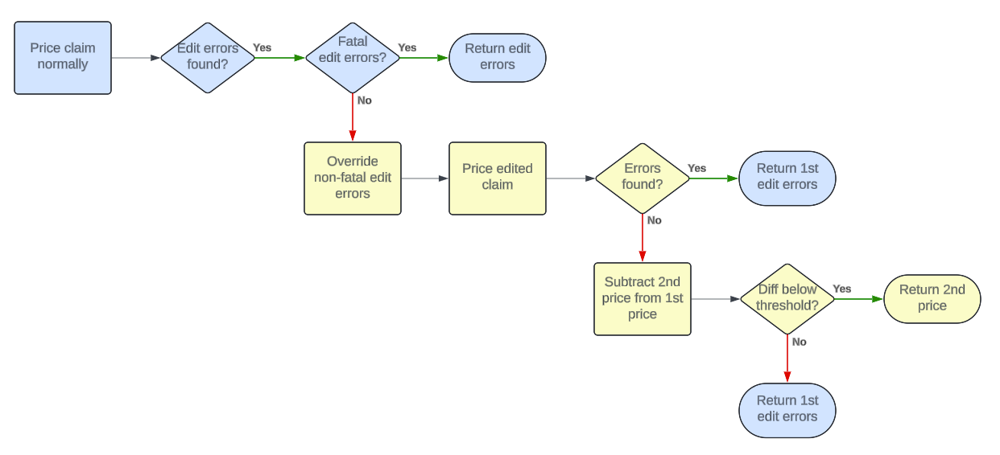

# mphgo

[](https://pkg.go.dev/github.com/mypricehealth/mphgo)


A Go client library to make it easy to connect to the My Price Health API. It can be accessed at https://api.myprice.health. This client library makes it easy to connect to the API for Go developers.

## The My Price Health API

The My Price Health API can be used to get pricing and estimated pricing for Medicare reimbursement. Medicare benchmarks are a great tool to advance the quadruple aim in healthcare.

## Usage

See also the examples folder for additional examples

```go

import (
	"context"
	"fmt"

	"github.com/mypricehealth/mphgo/mph"
)

func main() {
	var config = mph.PriceConfig{
		IsCommercial:                        true,  // uses commercial code crosswalks
		DisableCostBasedReimbursement:       false, // use cost-based reimbursement for MAC priced line-items
		UseCommercialSyntheticForNotAllowed: true,  // use synthetic Medicare for line items not allowed by Medicare, but which may still be paid by commercial plans
		UseDRGFromGrouper:                   false, // always use the DRG from the inpatient grouper (not applicable with UseBestDRGPrice set to true)
		UseBestDRGPrice:                     true,  // price both using the DRG supplied in the claim and the DRG from the grouper and return the lowest price
		OverrideThreshold:                   300,   // for claims which fail NCCI or other edit rules, override the errors up to this amount to get a price
		IncludeEdits:                        true,  // get detailed information from the code editor about why a claim failed
	}

	c := mph.NewDefaultClient("apiKey") // replace this with your API key
	result := c.Price(context.Background(), config, inpatientClaim)
	if result.Error != nil {
		fmt.Println(result.Error)
	} else {
		fmt.Println(result.Result.MedicareAmount)
	}
}

// fake inpatient claim for testing purposes
var inpatientClaim = mph.Claim{
	Provider: mph.Provider{
		NPI:         "1962999664",
		ProviderZIP: "35960",
	},
	DRG:                "461",
	PatientDateOfBirth: mph.NewDatePtr(1988, 1, 2),
	FormType:           mph.UBFormType,
	BillTypeOrPOS:      "111",
	BilledAmount:       47224,
	DateFrom:           mph.NewDate(2020, 2, 27),
	DateThrough:        mph.NewDate(2020, 2, 28),
	PrincipalDiagnosis: &mph.Diagnosis{Code: "N186"},
	OtherDiagnoses: []mph.Diagnosis{
		{Code: "Z992"},
		{Code: "I120"},
		{Code: "E6601"},
		{Code: "E785"},
		{Code: "Z6832"},
	},
	Services: []mph.Service{
		{LineNumber: "1", RevCode: "320", BilledAmount: 2126, DateFrom: mph.NewDate(2020, 2, 27), DateThrough: mph.NewDate(2020, 2, 27), ProcedureCode: "76000", Quantity: 1},
		{LineNumber: "2", RevCode: "360", BilledAmount: 28684, DateFrom: mph.NewDate(2020, 2, 27), DateThrough: mph.NewDate(2020, 2, 27), ProcedureCode: "36821", Quantity: 1},
		{LineNumber: "3", RevCode: "370", BilledAmount: 16414, DateFrom: mph.NewDate(2020, 2, 27), DateThrough: mph.NewDate(2020, 2, 27), ProcedureCode: "", Quantity: 48},
	},
}
```

## API configuration options

There are a number of configuration options available in the API which can be used to tailor how it works for specific use cases. They are as follows:

- `IsCommercial`. Medicare pricing is pretty unforgiving. CMS requires providers to submit claims to them in a specific way or they are rejected. They require providers to submit the right way or they will reject the claim. Since many of these rules do no apply to non-Medicare claims, we make it easier for commercial claims to get Medicare pricing by editing claims in a few specific ways. When set to true, we perform the following claim edits:

    - Crosswalk commercial payable codes to Medicare payable codes (e.g. 99215 to G0463 as per [this guidance](https://www.cms.gov/Regulations-and-Guidance/Guidance/Transmittals/Downloads/R2845CP.pdf))
    - Use existing Medicare payment rates for codes that are marked as not payable by Medicare, but which have a price supplied in the fee schedule (e.g. Pediatric visit CPT 99382). Even though these are not paid by Medicare (whose focus is for retired individuals), they are paid by commercial plans.
    - Don't error on codes which shouldn't have been submitted in a Medicare claim, but which would have $0 reimbursement anyway (e.g. Measurement codes)

- Synthetic Medicare Options. There are plenty of line items which can't be priced to Medicare since Medicare doesn't provide a price for them, but it doesn't make any sense for a commercial plan to pay nothing for them. For example, IUD's aren't covered by Medicare, but most commercial plan cover them. Synthetic Medicare offers a reasonable and defensible reimbursement rate for these situations. It is calculated using a combination of average Medicare reimbursement rates and provider-specific costs for applicable line items.
    - `DisableCostBasedReimbursement`. Line items which are listed in the Medicare fee schedule as being  "Carrier priced" or reimbursed at reasonable cost do not receive a standard reimbursement rate. Instead, each MAC determines the reimbursement rate for each provider based on cost and other factors. Since there is not a published MAC rate, by default, we use our Synthetic Medicare for these line items. If you do NOT wish to have these rates calculated, you may disable that calculation by setting `DisableCostBasedReimbursement` to true.
    - `UseCommercialSyntheticForNotAllowed`. Items which Medicare marks as "not allowed" are priced using our synthetic Medicare. This ensures that line items which don't apply to a Medicare population can still be paid by commercial plans using a similar benchmark. This setting does not affect items which would normally be bundled as those will still be priced as $0.

- DRG Grouping options. The standard CMS pricing procedure is to run the MS-DRG grouper on all inpatient claims before pricing. CMS doesn't use the DRG provided by the hospital on the claim, but only the DRG that it determines from the grouper. It is frequently found that hospitals are up-coding their DRG's on commercial claims in hopes of getting higher reimbursements. We've seen savings of tens of thousands of dollars on a single claim by pricing claims to the DRG from the grouper instead of the provider-supplied DRG. The DRG used for pricing may be found in the response under `InpatientPriceDetail.DRG`. May only set `UseDRGFromGrouper` or `UseBestDRGPrice` (not both).
    - `UseDRGFromGrouper`. To use the DRG that is returned from the grouper, set `UseDRGFromGrouper` to true. 
    - `UseBestDRGPrice`. On rare occasions, the DRG that is returned from the grouper will have a higher CMS reimbursement than the DRG on the claim. In most cases, the hospital is up-coding, not down-coding their DRG's, but to ensure that the lowest price is always paid, set `UseBestDRGPrice` to true. When set to true, the API will run the pricer twice, once for each DRG. Only the best price is used. 

- Commercial overrides. CMS has the scale and market power to force providers to submit claims exactly how they want and deny any claims that do not adhere to their standards. Not every payer wants to engage in that fight. Every claim denial means that it gets returned back to the provider, causing extra work for the provider as well as any third-party vendor that processes claims on behalf of the plan. Reprocessing claims is costly and fraught with error, especially when interim payments are made. For this reason, we offer the ability to specify a threshold that is worth denying a claim for. When `OverrideThreshold` is set, the API will price the claim twice. First it prices the claim normally. If there are edit errors, it will then override any non-fatal errors and get a new price. Since the 2nd pricing will now include prices for line items that were previously paid at $0 due to edit errors, the 2nd pricing may be higher than the first. If the difference in pricing between the 1st and 2nd pricing is less than the specified `OverrideThreshold`, the 2nd price will be returned without any errors. If the price exceeds the `OverrideThreshold`, the edit errors from the first pricing attempt will be returned. See the below flow for reference.  Some examples of overrides that may be attempted include:
    - "Medical visit on same day as a type T or S procedure without modifier 25" or "Code2 of a code pair that would be allowed by NCCI if appropriate modifier were present" errors. If the provider just forgot to put the appropriate modifier, it may be worth it to edit the claim to override this error and price the claim as if the appropriate modifier had been included.
    - "Questionable covered service". Since the decisions about what services are covered are not being made by Medicare for a commercial plan, it may make sense to override services like this that don't exceed a specified threshold.


- `IncludeEdits`. When a claim fails to price for some reason, CMS provides edit reasons back to providers to assist them in figuring out how to fix the claim to CMS standards. Set `IncludeEdits` to true to receive detailed reasons why a claim failed to price.

## Why Medicare Pricing?

It is possible and practical to achieve the quadruple aim in healthcare. With Medicare pricing for all your claims data, you’ll have the tools you need to:

- Lower cost through better provider negotiation, better plan design and more engaged members
- Better outcomes through an effective health plan prioritizing quality care, low cost and better health management
- Happier plan members through education and a better health plan
- More engaged providers who act as partners, not adversaries

For more information about how Medicare pricing can advance the quadruple aim in healthcare, see our [Advancing the quadruple aim with Medicare pricing white paper](https://myprice.health/Advancing%20the%20quadruple%20aim%20with%20Medicare%20pricing%20-%20v2.pdf).
